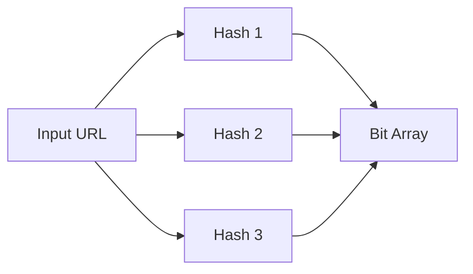
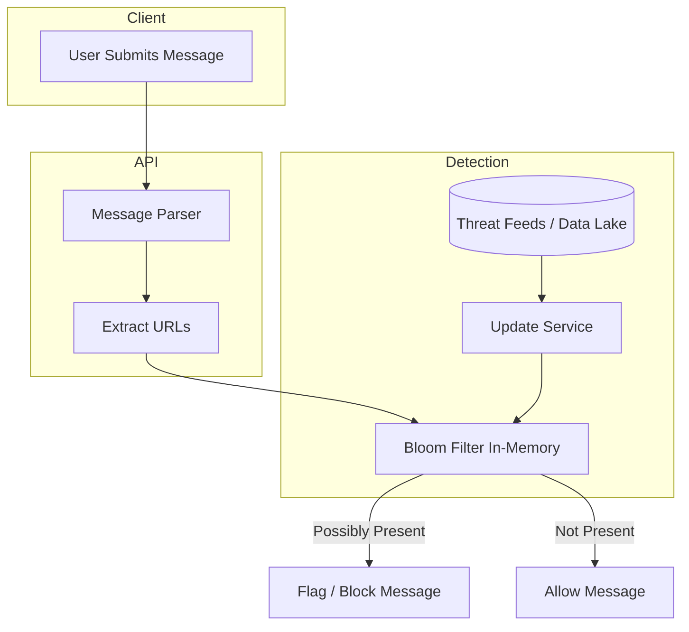

## Understanding the Problem: Scalable Spam Detection for User-Submitted URLs

Large-scale online platforms — forums, social networks, comment systems — face a constant battle against **spam and malicious URLs**. As the platform grows globally, malicious actors attempt to inject phishing links, scams, or malware URLs into user-generated content.

**Our Goal:** Detect malicious URLs *synchronously* in the message submission flow — with **billions of lookups/day**, low latency (<50ms end-to-end), and continuous updates from threat feeds.

---

## Key Challenges

- **Scale & Performance** — Billions of checks per day, requiring sub-10ms lookups per URL to leave room for other processing.
- **Massive & Dynamic Data** — Billions of known malicious URLs, with millions of updates per hour from sources like Google Safe Browsing, PhishTank, and internal machine learning.
- **Accuracy Trade-offs** —  
  - **False positives** (safe URL flagged) are tolerable — they trigger review.  
  - **False negatives** (missed malicious URL) are unacceptable.
- **No Database Bottlenecks** — Must avoid hitting a traditional DB per request — too slow and expensive.
- **Horizontal Scalability** — Must scale across data centers and regions.

---

## The Set Membership Problem

This boils down to: **Given a massive, rapidly updated set of malicious URLs, determine if a submitted URL belongs to it, in-memory, with O(1) lookups.**

Traditional approaches (hash sets, SQL lookups) are either too memory-heavy or too slow.

---

## Why Bloom Filters?

A **Bloom filter** is a probabilistic data structure for fast membership tests:
- **Guarantee:** No false negatives — if the filter says “not present,” it’s definitely safe.
- **Trade-off:** Some false positives — tunable to acceptable levels (e.g., <0.01%).
- **Benefits:**  
  - Memory efficiency: 10–15 bits per entry.
  - O(1) lookup time — independent of dataset size.
  - Easy to shard and replicate.

---

### How a Bloom Filter Works

1. **Initialization** — Create a bit array of size `m` (all zeros).
2. **Insertion** —  
   - Apply `k` independent hash functions to a URL.  
   - Each hash gives an index in the array; set those bits to `1`.
3. **Query** —  
   - Hash the URL with the same `k` functions.  
   - If *all* corresponding bits are `1`, the URL is *possibly present* (may be malicious).  
   - If any bit is `0`, it’s *definitely not present*.

---

### Bloom Filter Example Diagram

---

## System Architecture for Spam URL Detection

**Flow:**
1. User submits message → API extracts URLs.
2. Bloom filter checks URLs in O(1) time.
3. Positive → flag/block; Negative → pass through.
4. Update service periodically rebuilds or merges Bloom filter from threat feeds.

---

## Bloom Filter Parameters

Formulas:  
- `m = -n * ln(p) / (ln(2)^2)` — required bits for `n` entries at false positive rate `p`.
- `k = (m/n) * ln(2)` — optimal number of hash functions.

Example:  
- `n = 1 billion URLs`  
- Desired false positive rate `p = 0.1%`  
- `m ≈ 14.4 billion bits` (~1.8 GB memory)  
- `k ≈ 10 hash functions`

---

## Handling Frequent Updates

### Option 1: Periodic Rebuild
- Rebuild filter from scratch hourly with latest feeds.
- Swap new filter atomically.

### Option 2: Counting Bloom Filter
- Replace bits with small counters → support deletion.
- Slightly more memory usage.

### Option 3: Multi-Layer Filters
- **Base filter** for stable URLs.
- **Incremental filter** for recent additions — merged periodically.

---

## Distributed Bloom Filter Deployment

- **Sharding** — Hash URL → determine node → query that node’s filter.
- **Replication** — Keep copies across regions for fault tolerance.
- **Cache** — RedisBloom module for centralized in-memory access.
- **Kubernetes Scaling** — Auto-scale Bloom filter service with CPU/memory metrics.

---

## Potential Drawbacks and Mitigations

| Issue | Mitigation |
|-------|------------|
| False positives | Tune `m` and `k`; whitelist safe domains |
| Memory growth | Periodic rebuilds; use compressed bit arrays |
| No deletions in standard BF | Counting Bloom Filters or periodic resets |
| Hash flooding attacks | Use cryptographic or salted hashes |

---

## Hybrid Architecture for High Confidence

Bloom filter → if positive → **secondary verification** (small cache or rate-limited DB lookup).  
This keeps 99% of checks in-memory, hitting DB only for suspicious ones.

---

## Summary

Bloom filters provide:
- Sub-millisecond lookups for billions of entries.
- Memory efficiency and easy horizontal scaling.
- Predictable performance for real-time spam URL detection.

By integrating them into the ingestion path and designing for frequent updates, we achieve **global-scale spam detection** without sacrificing latency or user experience.

---
